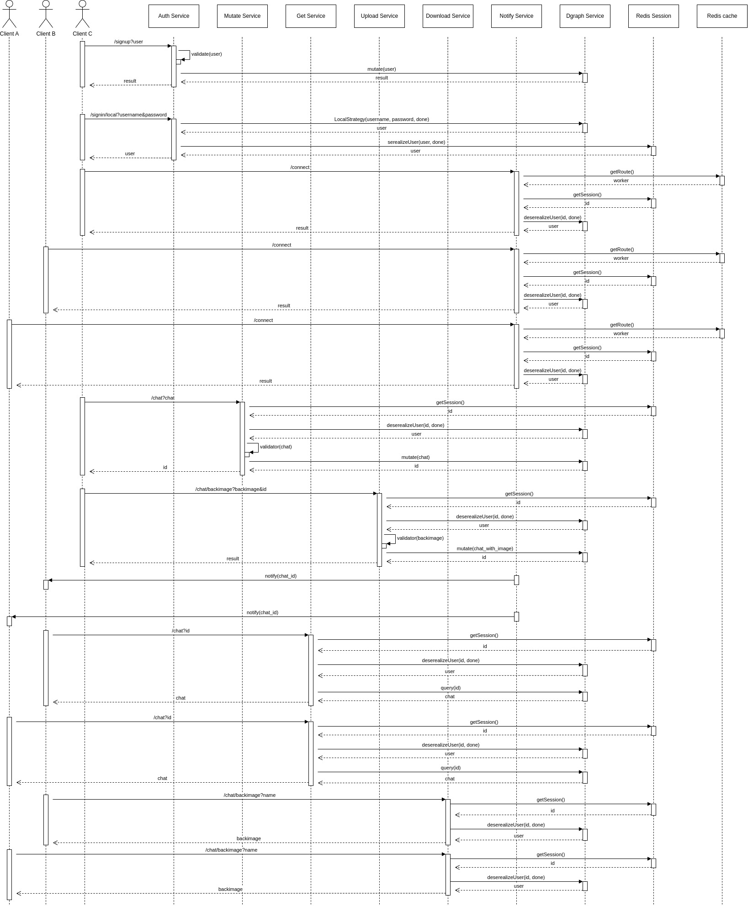

# UpLife Messenger
The highly available and scalable messenger for endless communication

## About

UpLife Messenger is a powerful and versatile messaging application that provides a seamless communication experience for users. With UpLife Messenger, you can stay connected with your friends, family, and colleagues in real-time.

One of the unique features of UpLife Messenger is support for checklists in messages, which makes it easy to manage tasks and collaborate with others. You can also add tags to your messages, which helps to organize and search for messages easily.

UpLife Messenger uses real-time notification by WebSocket to ensure that you never miss an important message. The backend is highly scalable and available, so you can rely on it to deliver messages reliably and quickly.

The app is open source, so you can customize it to suit your needs or contribute to the community. You can also customize your profile with avatars and backgrounds, and the app has a powerful contact system to help you manage your connections.

With real-time communication, you can enjoy seamless conversations with your contacts, whether you're on the go or at your desk. 

## Features

- Real-time messaging
- User registration, authentication and authorization
- Group chats
- Message history
- Animated avatars and backgrounds
- Check lists in messages
- Message Tags

## Requirements

- Docker 18.06.0+
- Artillery 1.5.0+ (for load testing)

## Installing

To install UpLife Messenger Backend, clone the repository from GitHub:

```bash
git clone https://github.com/XNM1/UpLife_Backend
```

## Usage

To start the application with Docker, use the following command:

```bash
docker compose up back-end/docker-compose-dev.yml
```

## Test

To run load tests with Artillery, use the following command:

```bash
artillery run load-tests/get_data_test.yml
```

## Architecture


*Backend Architecture Diagram*

UpLife Messenger Backend is built using the following technologies:

- Node.js
- Express
- Socket.io
- Passport.js
- Dgraph
- Redis
- Nginx
- HAProxy
- Docker

The architecture of UpLife Messenger utilizes of the following patterns:


*CQRS Diagram*


*Event Bus Diagram*

Data scheme diagrams:


*Entity-Relationship Diagram*


*Graph Representation of Data*

Here's a sequence diagram that illustrates the interaction between the different components of the system:


*Sequence Diagram*

## License

This project is licensed under the MIT License - see the [LICENSE](LICENSE) file for details. 